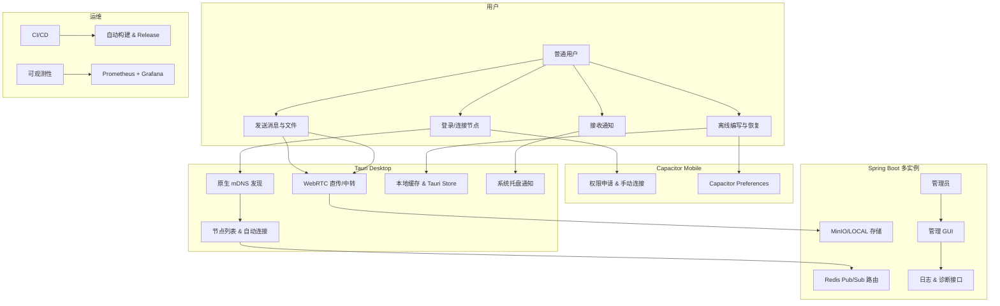

# LANChat v3.0 产品需求文档（PRD）

**版本**：1.0  
**日期**：2026-07-17  
**状态**：正式版（基于 v2.3 研究报告生成）

---

## 1. 文档概述

### 1.1 产品背景
LANChat v2.3 已实现可靠的局域网即时协作核心功能（可靠消息、离线发件箱、重连补拉、统一会话模型、WebRTC 文件传输、MinIO/LOCAL 存储、多实例 Redis 路由等）。  
v3.0 的核心目标是将 Web 浏览器应用升级为**独立桌面与移动端原生应用**，并完善工程化能力，使其成为可分发、可运维的完整产品。

### 1.2 产品目标
- **业务目标**：降低部署门槛，提升用户体验，实现“安装即用 + 自动发现”。
- **技术目标**：复用现有前端/后端，引入 Tauri（桌面）+ Capacitor（移动），补齐 CI/CD、可观测性、发布流水线。
- **版本定位**：v3.0 聚焦“客户端形态升级 + 工程化闭环”，不涉及聊天核心重构。

### 1.3 成功指标（OKR）
- **Objective**：推出可独立安装的多端客户端。
- **KR1**：桌面（Windows）安装包 + 自动更新上线。
- **KR2**：Android 版进入内测，核心功能可用。
- **KR3**：CI/CD 全覆盖主流程，E2E 测试通过率 ≥ 95%。
- **KR4**：节点自动发现成功率 ≥ 80%（局域网）。

---

## 2. 用户画像

1. **普通团队成员**（Primary）：25-40 岁，需要快速收发消息、共享文件。
2. **管理员/运维**（Secondary）：负责部署、监控，需要管理工具。
3. **临时协作用户**：访客模式或临时房间。

---

## 3. 功能需求

### 3.1 核心功能模块

**模块 1：桌面客户端（Tauri） - P0**
- 复用 Vue 3 前端。
- 原生特性：托盘、单实例、系统通知、开机自启、深链。
- 原生 mDNS 发现。
- 桌面管理 GUI（节点、日志、诊断）。

**模块 2：移动客户端（Capacitor） - P1**
- Android 优先，支持签名打包。
- 局域网权限、后台运行、通知。
- iOS beta 支持。

**模块 3：局域网发现与连接**
- 客户端零配置发现。
- 历史节点、手动输入回退。

**模块 4：离线增强**
- 任务队列、草稿恢复、文件续传。
- 本地安全凭证存储。

**模块 5：发布与更新**
- 代码签名、自动更新（Tauri Updater + GitHub Release）。

**模块 6：工程保障**
- CI/CD 流水线。
- 测试（Testcontainers + E2E）。
- 可观测性（Actuator + Prometheus + Tracing）。

### 3.2 用例图



### 3.3 API 变更列表

| API 路径                    | 方法 | 类型     | 说明 |
|-----------------------------|------|----------|------|
| `/api/v1/node/info`         | GET  | 增强     | 返回更多元数据供客户端发现 |
| `/api/v1/admin/diagnostics` | GET  | 新增     | 诊断打包接口 |
| `/api/v1/admin/logs`        | GET/WS | 增强   | 支持实时日志 |
| `/api/v1/health`            | GET  | 新增     | Actuator 健康检查 |
| WebSocket                   | -    | 增强     | 新增客户端类型标识 |

---

## 4. 仓库结构调整

```text
lan-chat/
├── frontend/                    
├── src/main/java/...            
├── apps/
│   ├── desktop/                 # Tauri
│   └── mobile/                  # Capacitor
├── ops/
│   ├── compose/
│   └── monitoring/
├── .github/workflows/
└── docs/v3/
```

**迁移步骤**：
1. 抽离 frontend 构建命令。
2. 初始化 desktop 与 mobile 目录。
3. 拆分 Compose 配置。

---

## 5. 实现计划与里程碑

**阶段 1（4-6 周）**：Tauri 桌面壳 + mDNS + 管理 GUI  
**阶段 2（2-3 周）**：签名、打包、自动更新  
**阶段 3（3-4 周）**：Android 封装  
**阶段 4（3-4 周）**：测试 + 可观测性

**总验收标准**：
- 可安装、可发现、可更新
- CI/CD 自动化
- 核心功能稳定

---

**文档结束**  
更多细节可参考前期研究报告。