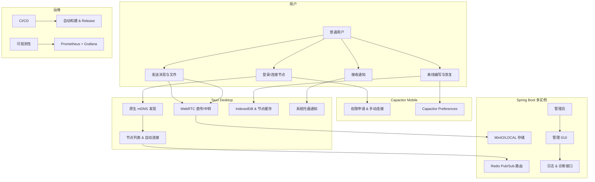

# LANChat v3.0 产品需求文档（PRD）

**版本**：1.1
**日期**：2026-07-19
**状态**：需求基线已确认，V3.0 开发中

---

## 1. 文档概述

### 1.1 产品背景
LANChat v2.3 已实现可靠的局域网即时协作核心功能（可靠消息、离线发件箱、重连补拉、统一会话模型、WebRTC 文件传输、MinIO/LOCAL 存储、多实例 Redis 路由等）。  
v3.0 的核心目标是将 Web 浏览器应用升级为**独立桌面与移动端原生应用**，并完善工程化能力，使其成为可分发、可运维的完整产品。

### 1.2 产品目标
- **业务目标**：降低部署门槛，提升用户体验，实现“安装即用 + 自动发现”。
- **技术目标**：复用现有前端/后端，引入 Tauri（桌面）+ Capacitor（移动），补齐 CI/CD、可观测性、发布流水线。
- **版本定位**：v3.0 聚焦“客户端形态升级 + 工程化闭环”，不涉及聊天核心重构。

### 1.3 成功指标（OKR）
- **Objective**：推出可独立安装的多端客户端。
- **KR1**：macOS 桌面端 P0 完成安装、签名、公证和自动更新验证，Windows/Linux 纳入构建与 Release 矩阵。
- **KR2**：Android 版进入内测，核心功能可用。
- **KR3**：CI/CD 全覆盖主流程，E2E 测试通过率 ≥ 95%。
- **KR4**：节点自动发现成功率 ≥ 80%（局域网）。

---

## 2. 用户画像

1. **普通团队成员**（Primary）：25-40 岁，需要快速收发消息、共享文件。
2. **管理员/运维**（Secondary）：负责部署、监控，需要管理工具。
3. **临时协作用户**：访客模式或临时房间。

---

## 3. 功能需求

### 3.1 核心功能模块

**模块 1：桌面客户端（Tauri） - P0**
- 复用 Vue 3 前端。
- 原生特性：托盘、单实例、系统通知、开机自启、深链。
- 原生 mDNS 发现、节点缓存、健康探测和手动地址回退。

**模块 1.1：Server Manager - P1**
- 桌面管理 GUI（节点、日志、诊断、备份辅助）。

**模块 2：移动客户端（Capacitor） - P1**
- Android 优先，支持签名打包。
- 局域网权限、后台运行、通知。
- iOS beta 支持。

**模块 3：局域网发现与连接**
- 客户端零配置发现。
- 历史节点、手动输入回退。

**模块 4：离线增强 - P1**
- 任务队列、草稿恢复、文件续传。
- 本地安全凭证存储。

**模块 5：发布与更新 - P0**
- 代码签名、自动更新（Tauri Updater + GitHub Release）。

**模块 6：工程保障**
- CI/CD 流水线。
- 测试（Testcontainers + E2E）。
- 双实例消息与断网恢复 E2E 属 P0；Testcontainers 和可观测性（Actuator + Prometheus + Tracing）属 P1/P2。

### 3.2 用例图



### 3.3 API 变更列表

| API 路径                    | 方法 | 类型     | 说明 |
|-----------------------------|------|----------|------|
| `/api/v1/node/info`         | GET  | 已增强   | 返回协议、API、WebSocket、健康、应用路径和桌面认证能力 |
| `/api/v1/node/health`       | GET  | 复用     | 原生发现握手后的健康探测 |
| `/api/v1/auth/login`        | POST | 已增强   | 接受并保留 `desktop` 设备类型 |
| `/api/v1/auth/refresh`      | POST | 复用     | Rust 原生 Cookie Jar 轮换 Refresh Token |
| WebSocket `/ws/chat`        | -    | 已适配   | Tauri 精确 Origin 白名单；连接后继续使用 `AUTH` |

管理员诊断和日志接口继承 V2.3，本轮没有把 P1 的诊断包、实时日志或 Actuator 伪列为已实现。

---

## 4. 仓库结构调整

```text
lan-chat/
├── frontend/                    
├── src/main/java/...            
├── apps/
│   ├── desktop/                 # 已实现 Tauri P0
│   └── mobile/                  # P1/P2 待开发
├── tests/e2e/                   # 首批双实例/断网 E2E
├── scripts/ci/                  # CI 与测试辅助
├── scripts/release/             # Updater 配置与 Compose 打包
├── ops/monitoring/              # P1/P2 待开发
├── .github/workflows/
└── PRD/v3/docs/v3/
```

**迁移步骤**：
1. 复用现有 `frontend/`，增加 Web/Tauri 适配层和桌面构建命令。
2. 在 `apps/desktop/` 内维护 Tauri Rust 壳；移动端到 P1 再初始化。
3. 保留生产 `compose.yaml`，使用 `compose.e2e.yaml` 做隔离测试覆盖。

---

## 5. 实现计划与里程碑

**阶段 1（4-6 周）**：Tauri 桌面壳 + mDNS + 管理 GUI  
**阶段 2（2-3 周）**：签名、打包、自动更新  
**阶段 3（3-4 周）**：Android 封装  
**阶段 4（3-4 周）**：测试 + 可观测性

**总验收标准**：
- 可安装、可发现、可更新
- CI/CD 自动化
- 核心功能稳定

## 6. 当前实施边界

| 范围 | 2026-07-19 状态 |
|---|---|
| Tauri 壳、托盘、通知、单实例、自启、深链 | 代码已实现，待真实 macOS 系统回归 |
| 原生 mDNS、握手、健康、缓存、手动地址 | 代码已实现，待真实局域网多播回归 |
| 通用 CI、三平台桌面 build、双实例/断网 E2E | 工作流和测试代码已实现，待远端环境运行证据 |
| 签名、macOS 公证、Updater、正式 Release | 流水线已接线；缺少外部 Secrets/证书和实际产物，不能标记完成 |
| Server Manager、Android/iOS、离线增强、完整可观测性 | P1/P2，尚未实现 |

正式发布必须由受保护环境提供 Tauri Updater 私钥、Apple Developer ID/公证凭据和 Windows 代码签名证书。仓库只保存公用配置与流水线，不保存或生成占位私钥。准确证据和验证命令见 [实施状态-V3.0.md](docs/v3/实施状态-V3.0.md)。

---

**文档结束**  
更多细节可参考前期研究报告。
