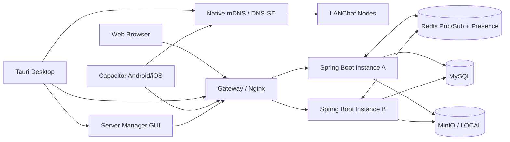
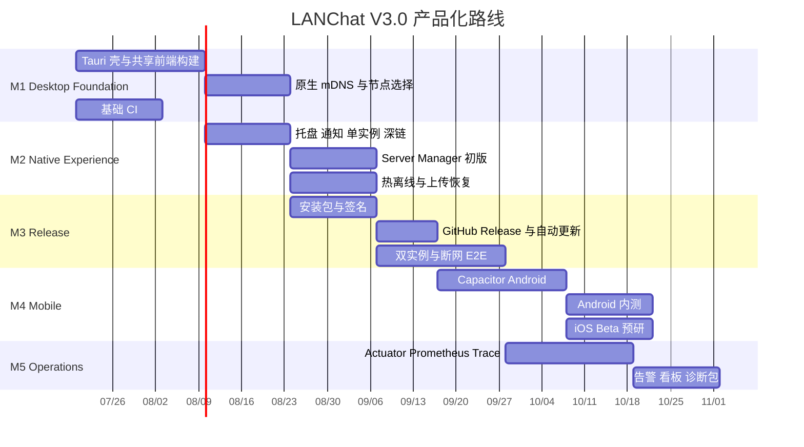

# LANChat

> LAN-first 私有即时协作系统：局域网优先、断网可恢复、数据可控、网络恢复后可选同步。

[](#v30-p0-当前交付)
[](https://github.com/Atti-20/lan-chat/tree/feature/v2.3)
[](https://v2.tauri.app/)
[](https://capacitorjs.com/)
[](https://spring.io/projects/spring-boot)

LANChat 面向校园、工厂、办公室、项目现场与应急环境，目标是在组织自有网络中提供可部署、可管理、可恢复的即时沟通和文件协作能力。

当前开发代码基线是 **V3.0.0-dev**，已继承 V2.3.0 的可靠消息、文本离线发件箱、重连补拉、文件安全、WebRTC 文件直传与中转降级、临时协作房间、应急广播、分片上传、断点续传、LOCAL/MinIO 私有存储，以及同一逻辑节点内的多实例实时路由。

V3.0 首轮已落地 macOS 桌面端 P0，以及 Capacitor Android P1 工程与无签名构建定义；这不等同于已经发布 V3.0。签名安装包、公证、Updater 实际升级和 GitHub Release 仍需仓库 Secrets、Apple/Windows/Android 证书与真实平台运行证据。Server Manager、iOS、离线增强与完整可观测性尚未实现。

---

## 目录

- [版本定位](#v30-版本定位)
- [当前能力](#v23-已实现基线)
- [V3.0 目标](#v30-目标能力)
- [P0 当前交付](#v30-p0-当前交付)
- [总体架构](#总体架构)
- [技术选型](#技术选型)
- [目标目录结构](#目标目录结构)
- [里程碑](#开发里程碑)
- [快速启动](#快速启动-v23-基线)
- [文档导航](#文档导航)
- [范围边界](#范围边界)

## V3.0 版本定位

V3.0 的核心不是增加更多聊天按钮，而是完成五类产品化升级：

1. **桌面化**：基于 Tauri 2 提供 Windows、macOS、Linux 可安装客户端。
2. **移动化**：基于 Capacitor 提供 Android 优先、iOS Beta 的移动客户端。
3. **零配置连接**：通过原生 mDNS/DNS-SD、二维码、历史节点和手动地址形成多路径节点发现。
4. **工程化交付**：安装包、签名、自动更新、GitHub Release、CI/CD、端到端测试。
5. **可运维化**：服务管理 GUI、健康检查、指标、日志、Trace 与诊断包。

### 设计目标

| 目标 | 说明 |
|---|---|
| LAN-first | 默认围绕组织自有网络运行，互联网不可用时仍保留局域网协作能力 |
| Private by default | 账号、消息、文件、日志和对象存储由部署方控制 |
| Reuse before rewrite | 复用 V2.3 的 Vue 前端、Spring Boot 服务端、MySQL、Redis、MinIO 与协议 |
| Progressive enhancement | Web 继续可用；桌面和移动壳提供原生发现、通知、托盘、更新等增强 |
| Evidence-based status | 文档只把存在代码、测试或构建产物的能力标记为已实现 |

## V2.3 已实现基线

| 能力域 | 状态 | 说明 |
|---|---|---|
| 账号、好友、私聊、群聊、设备管理 | 已实现 | Web 客户端与单实例/多实例服务端 |
| 统一会话与可靠消息 | 已实现 | `clientMsgId` 幂等、事务提交后 ACK、会话序列、游标补拉 |
| 文本断网恢复 | 已实现 | IndexedDB 缓存、文本发件箱、重连自动补发与增量同步 |
| 文件安全 | 已实现 | 扩展名、MIME、文件头校验，显式授权、签名预览、访问审计 |
| WebRTC 文件直传 | 已实现 | DataChannel 优先，失败或超时自动降级至服务端中转 |
| 临时协作房间 | 已实现 | 房间码、角色、有效期、文件策略与生命周期 |
| 应急广播 | 已实现 | 授权发布、在线推送、离线补拉、回执统计、撤销留痕 |
| 分片上传与断点续传 | 已实现 | 分片幂等、缺片查询、完整哈希与内容复核 |
| LOCAL/MinIO 私有存储 | 已实现 | 单机本地存储与多实例共享对象存储切换 |
| 多实例实时路由与 Presence | 已实现 | 同一逻辑节点共享 MySQL、Redis、MinIO |
| 服务端 mDNS 发现 | 已实现 | JVM 服务广播、发现、握手和登录页节点切换 |
| 管理诊断与运行日志 | 已实现基础版 | Request ID、依赖/JVM/WebSocket 诊断、日志筛选和导出 |

## V3.0 目标能力

| 工作流 | V3.0 目标 | 初始优先级 | 当前状态 |
|---|---|---:|---|
| Desktop Client | Tauri 壳、托盘、通知、单实例、开机自启、深链 | P0 | 代码已实现，待 macOS 安装包回归 |
| Native Discovery | 客户端原生 mDNS/DNS-SD、节点缓存、健康探测、回退路径 | P0 | mDNS、握手、缓存、健康与手动地址已实现；二维码转为 P1 |
| Release Pipeline | Windows/macOS/Linux 构建、签名、Release、自动更新 | P0 | 流水线代码已实现；真实签名、公证、Updater 与 Release 待外部凭据验证 |
| CI/CD & E2E | 前后端检查、桌面构建、双实例/断网 E2E | P0 | 工作流与测试代码已实现，待 GitHub/Docker 完整运行证据 |
| Server Manager | 节点、日志、健康、备份、诊断与本机部署辅助 GUI | P1 | 规划完成，待开发 |
| Android Client | Capacitor Android 客户端、权限适配、通知与文件 | P1 | 工程与无签名 CI 已实现；待 Android SDK、真实设备、受控 LAN HTTP 和签名 AAB 回归 |
| iOS Client | Capacitor iOS Beta、本地网络权限与 Bonjour 声明 | P2 | 预研项 |
| Offline Enhancement | 草稿、上传任务恢复、热离线增强、安全凭证封装 | P1 | 规划完成，待开发 |
| Observability | Actuator、Prometheus、Grafana、Micrometer Tracing | P1 | 规划完成，待开发 |

## V3.0 P0 当前交付

### 已落地代码

- `apps/desktop/src-tauri/`：Tauri 2 壳、关闭隐藏到托盘、托盘打开/重扫/检查更新/退出、单实例、自启隐藏、通知和白名单深链。
- Rust Native Bridge：按节点隔离的原生登录/刷新 Cookie Jar；Refresh Token 不进入 JavaScript、`localStorage` 或 IndexedDB。
- 原生发现：浏览 `_lanchat._tcp.local.`，校验协议和节点 ID，调用 `/api/v1/node/info` 与健康端点握手，记录延迟/健康/来源并持久化最多 32 个缓存节点；支持经握手验证的手动地址。
- 共享 Vue 客户端：REST、WebSocket 和资源地址随选中节点切换，缓存按“节点 + 用户”隔离；Web 环境继续使用同源路径。
- Spring Boot：明确支持 `desktop` 设备类型，公开协议/路径能力，统一精确 Origin 的 CORS 与 WebSocket 白名单，并与 mDNS TXT 元数据保持一致。
- 工程化：通用 CI、三平台无签名桌面 smoke build、桌面签名草稿 Release、服务端 GHCR/Compose 发布包、双实例消息和浏览器断网发件箱 E2E。

### 尚不能标记为完成

- 仓库内没有 Apple Developer ID、Windows PFX 或 Tauri Updater 私钥，也不会生成占位密钥。
- 尚未产生经 Developer ID 签名、公证并 stapling 的 macOS `.app`/`.dmg`，也没有经真实安装验证的 Windows/Linux 产物。
- Updater 客户端和发布流水线已接线，但必须在受保护环境注入 `TAURI_SIGNING_PRIVATE_KEY`、`TAURI_UPDATER_PUBLIC_KEY` 及平台签名 Secrets，并从旧版本执行一次真实升级才能验收。
- GitHub Actions、真实局域网多播、自托管 mDNS runner 和完整 Docker E2E 的运行结果必须另行留存；仅存在工作流或测试文件不等于这些环境已经验证通过。
- 二维码回退、Server Manager、Capacitor iOS、上传任务跨重启恢复、Prometheus/Trace/Grafana 仍属于 P1/P2 或后续工作；Android 已有工程基础，但真实设备、签名 AAB 和发布尚未验收。

## 总体架构



### 产品形态

- **LANChat Server**：Spring Boot 服务、MySQL、Redis、MinIO、Nginx、管理接口与部署脚本。
- **LANChat Web**：保留浏览器访问，作为零安装回退入口。
- **LANChat Desktop**：复用 Vue UI，通过 Tauri 增加原生网络发现、托盘、通知、更新和本机辅助能力。
- **LANChat Mobile**：复用 Vue UI，通过 Capacitor 对接 Android/iOS 原生工程与权限体系。
- **LANChat Server Manager**：面向管理员的节点与部署工作台，可作为桌面端受控模块或独立入口。

## 技术选型

### 桌面端：Tauri 2

选择 Tauri 的主要原因：

- 直接复用现有 Vue/Vite 构建产物；
- 使用系统 WebView，不随应用捆绑完整 Chromium；
- 官方提供系统托盘、通知、单实例、自动启动、Updater、Store、Stronghold、Sidecar 等能力；
- 权限可通过 capabilities 和插件 scope 进行细粒度限制；
- 适合将 mDNS 浏览器、日志收集器和部署助手放入 Rust 命令或受控 sidecar。

### 移动端：Capacitor

选择 Capacitor 的主要原因：

- Android、iOS、Web 为官方支持目标；
- 可直接生成和维护 Android Studio、Xcode 原生工程；
- 原生权限、Network Security Config、`Info.plist`、App Links 和 Universal Links 可按平台配置；
- 与现有 Web 前端的迁移成本较低；
- Android 可先行交付，iOS 可在权限和签名条件成熟后进入 Beta。

### 服务端：延续 V2.3 基线

- Java 17 + Spring Boot 3.5
- Spring Security + JWT Access/Refresh
- Spring WebSocket + 自定义 V1 JSON 信封
- MySQL 8 + MyBatis Plus
- Redis Pub/Sub + Presence
- LOCAL / MinIO 私有文件存储
- Dockerfile + Docker Compose + Nginx

## 目标目录结构

```text
lan-chat/
├─ frontend/                         # 现有 Vue 3 UI 主源码
├─ src/main/java/com/lanchat/        # 现有 Spring Boot 服务端
├─ src/main/resources/static/app/    # Web 构建输出，继续支持同源托管
├─ apps/
│  ├─ desktop/
│  │  └─ src-tauri/
│  │     ├─ tauri.conf.json
│  │     ├─ capabilities/
│  │     ├─ src/
│  │     └─ binaries/
│  └─ mobile/
│     ├─ capacitor.config.ts
│     ├─ android/
│     └─ ios/
├─ ops/
│  ├─ compose/
│  └─ monitoring/
├─ scripts/
│  ├─ ci/
│  ├─ release/
│  └─ version/
├─ docs/
│  └─ v3/
│     ├─ 需求分析-V3.0.md
│     ├─ 功能分析-V3.0.md
│     └─ 实施状态-V3.0.md
└─ .github/workflows/
```

## 开发里程碑



| 里程碑 | 主要交付物 | 退出条件 |
|---|---|---|
| M1 | Tauri 基础壳、共享前端构建、桌面端 mDNS、基础 CI | 核心代码已落地；待 macOS 应用内主链路回归 |
| M2 | 托盘、通知、单实例、深链 | P0 原生体验代码已落地；Server Manager 仍为 P1 |
| M3 | 安装包、签名、Release、Updater、E2E | 流水线与测试定义已落地；真实签名产物、升级和远端 E2E 未完成 |
| M4 | Android 内测、iOS Beta | Android 完成登录、聊天、文件与节点连接；iOS 主链路可用 |
| M5 | 指标、Trace、看板、告警与诊断包 | 关键问题可通过指标、日志和 Trace 定位 |

## 快速启动

### Docker Compose

```bash
cp .env.example .env
chmod 600 .env
# 修改 .env 中所有数据库、Redis、MinIO、JWT 与管理员密钥
docker compose config --quiet
docker compose up --build -d
docker compose ps
```

浏览器访问：

```text
http://localhost:8080/app/
```

### 本地开发

```bash
# 前端
cd frontend
npm ci
npm run build
cd ..

# 后端
./mvnw spring-boot:run
```

### macOS 桌面开发

需要 Node.js 20.19+、Rust stable、Xcode Command Line Tools，以及 Tauri 2 的 macOS 构建依赖。

```bash
npm ci --prefix frontend
npm ci --prefix apps/desktop
npm --prefix apps/desktop run dev
```

本地无签名构建：

```bash
npm --prefix frontend run build:desktop
npm --prefix apps/desktop run build:app
npm --prefix apps/desktop run build:dmg
```

本地生成的无签名包只用于开发验收，不能替代 Developer ID 签名、公证和正式分发验证。

### 当前验证命令

```bash
npm ci --prefix frontend
npm ci --prefix apps/desktop
npm ci --prefix tests/e2e

./mvnw -B test
npm test --prefix frontend
npm run typecheck --prefix frontend
npm run build --prefix frontend
npm run build:desktop --prefix frontend

cargo fmt --all --manifest-path apps/desktop/src-tauri/Cargo.toml -- --check
cargo check --locked --manifest-path apps/desktop/src-tauri/Cargo.toml
cargo test --locked --manifest-path apps/desktop/src-tauri/Cargo.toml

npm run typecheck --prefix tests/e2e
docker compose -f compose.yaml -f compose.e2e.yaml config --quiet
git diff --check
```

具备 Docker 环境时，再启动双实例栈并执行 `npm test --prefix tests/e2e`。真实 mDNS 发现需要具有可用多播网卡的 macOS 或自托管 runner，不能由普通云端容器结果替代。

## 文档导航

| 文档 | 用途 |
|---|---|
| [需求分析 V3.0](docs/v3/需求分析-V3.0.md) | 产品定位、角色、场景、功能与非功能需求、验收口径 |
| [功能分析 V3.0](docs/v3/功能分析-V3.0.md) | 模块拆分、流程、状态、异常、权限、接口与测试设计 |
| [实施状态 V3.0](docs/v3/实施状态-V3.0.md) | V2.3 继承基线、V3.0 工作流进度、证据与下一步 |
| [V2.3 分支](https://github.com/Atti-20/lan-chat/tree/feature/v2.3) | 当前代码与文档基线 |

## 范围边界

V3.0 明确不把以下事项提前声明为已实现：

- 独立数据库节点之间的双向复制；
- 跨独立节点的权限传播、冲突检测和冲突合并；
- 完全冷启动离线登录；
- 端到端加密；
- 本地 AI 助手；
- 未经压测验证的并发量、SLA 或极限性能指标；
- 未签名、未公证、未发布或未产生可安装产物的发布能力。

## 安全原则

- Token 不进入 WebSocket URL、代理访问日志或明文配置示例。
- 桌面端 Tauri capabilities 遵循最小权限，Sidecar 仅开放固定命令和固定参数。
- Android 局域网明文 HTTP 只允许受控开发/内网例外，正式部署优先 HTTPS/WSS。
- iOS 明确声明本地网络用途及 Bonjour 服务类型。
- 签名私钥、PFX、Android keystore 和 Updater 私钥仅存放在受保护发布环境。
- 管理 GUI 的进程控制、备份和日志导出均需管理员权限和显式确认。

## 参考资料

- [LANChat feature/v2.3](https://github.com/Atti-20/lan-chat/tree/feature/v2.3)
- [Tauri 2 Documentation](https://v2.tauri.app/)
- [Tauri Updater](https://v2.tauri.app/plugin/updater/)
- [Tauri Sidecar](https://v2.tauri.app/develop/sidecar/)
- [Capacitor Documentation](https://capacitorjs.com/docs/)
- [Android Network Security Configuration](https://developer.android.com/privacy-and-security/security-config)
- [Apple Local Network Privacy](https://developer.apple.com/documentation/technotes/tn3179-understanding-local-network-privacy)
- [GitHub Actions Documentation](https://docs.github.com/actions)
- [Spring Boot Actuator](https://docs.spring.io/spring-boot/reference/actuator/index.html)
- [Spring Boot Testcontainers](https://docs.spring.io/spring-boot/reference/testing/testcontainers.html)
- [Docker Compose](https://docs.docker.com/compose/)
