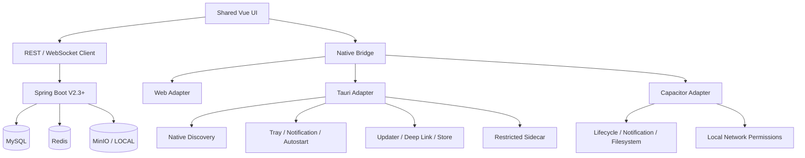
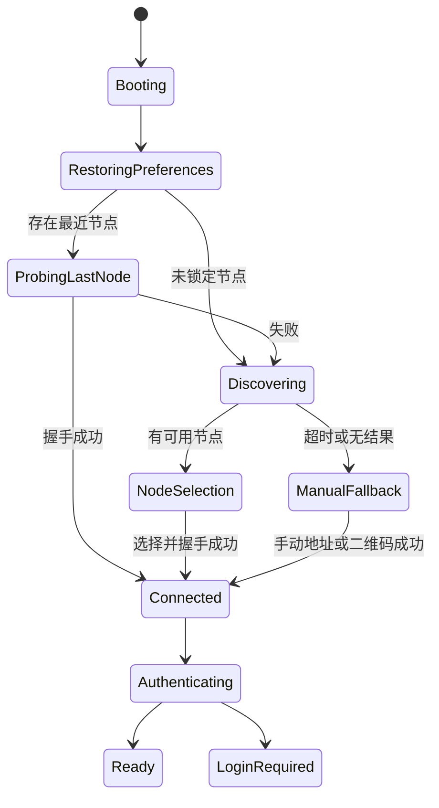
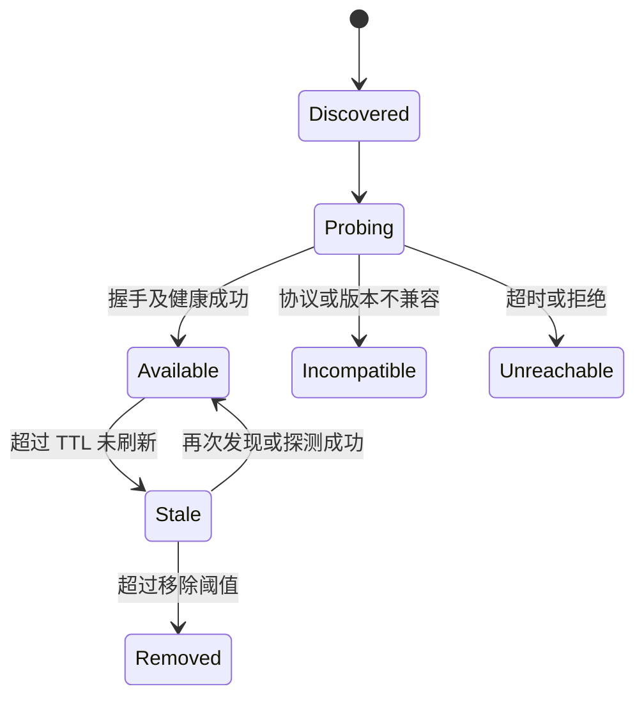
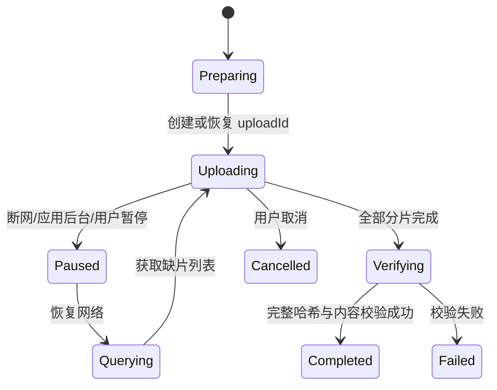
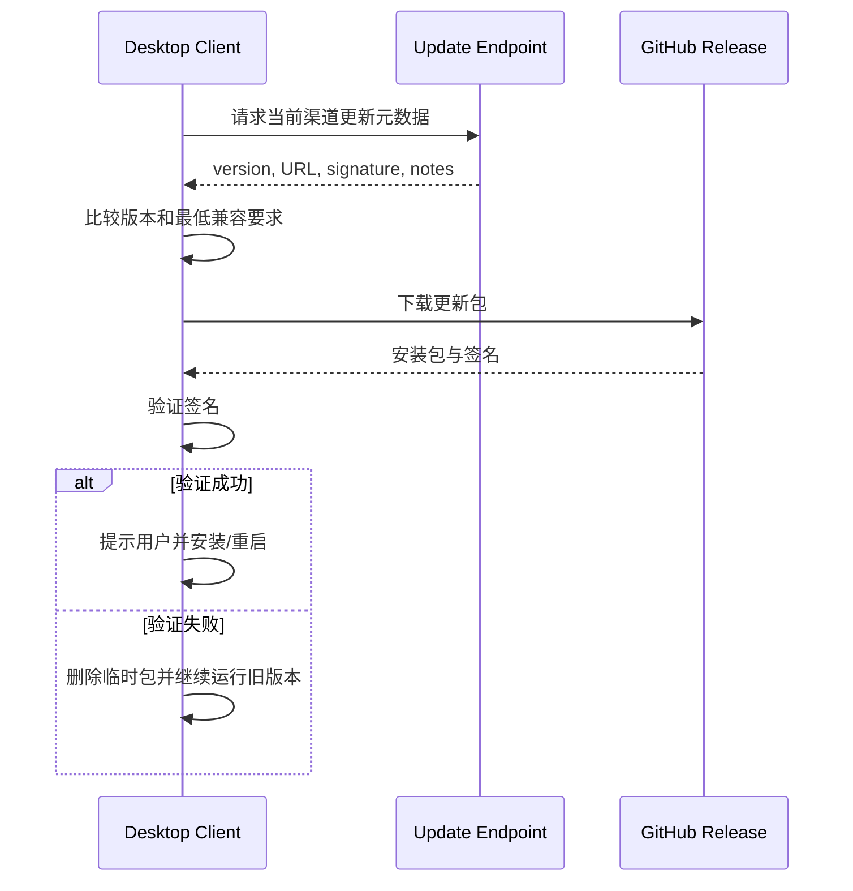

# LANChat 功能分析（V3.0）

> 基于 V2.3.0 已实现能力的 V3.0 产品化功能设计  
> 更新日期：2026-07-17

## 1. 文档目标

本文将《需求分析-V3.0.md》转换为可开发、可测试的功能模块、流程、状态、权限和异常处理规则。V3.0 继续复用 V2.3 的服务端协议、可靠消息、文件授权和会话模型，不另建重复业务核心。

## 2. 设计原则

1. **Web 核心共用**：Vue 组件、状态模型、API 客户端和 WebSocket 协议尽量保持单源。
2. **原生能力适配**：通过 `NativeBridge` 或等价接口隔离 Tauri、Capacitor 和 Web 差异。
3. **安全降级**：原生发现失败时回退到二维码、历史地址和手动输入，而不是阻断登录。
4. **真实状态**：UI 区分“已认证热离线”“冷启动未认证”“节点不可达”“服务降级”。
5. **最小权限**：桌面 capabilities、Sidecar、移动权限和管理操作按功能最小开放。
6. **发布可回滚**：更新失败不得破坏现有安装、缓存和用户数据。

## 3. 模块总览



| 模块 | 主要职责 | 是否复用 V2.3 |
|---|---|---|
| Shared Web Core | 页面、会话、消息、文件、房间、广播、认证 | 是 |
| Desktop Shell | 窗口、托盘、通知、单实例、深链、更新 | 新增 |
| Native Discovery | mDNS/DNS-SD、节点验证、缓存和排序 | 新增客户端层；复用服务端广播 |
| Server Manager | 节点、诊断、日志、版本、备份辅助 | 复用管理接口并新增整合 UI |
| Mobile Shell | Android/iOS 生命周期、权限、通知、文件 | 新增 |
| Offline Runtime | 草稿、上传恢复、安全本地存储 | 扩展 V2.3 IndexedDB 发件箱 |
| Release Platform | 构建、签名、更新元数据和 Release | 新增 |
| Observability | Health、Metrics、Trace、Dashboards | 扩展 V2.3 日志与诊断 |

## 4. 共享客户端运行时

### 4.1 环境识别

客户端启动时识别运行环境：

```ts
export type RuntimeKind = 'web' | 'tauri' | 'capacitor-android' | 'capacitor-ios'
```

业务层不得直接散布 `window.__TAURI__` 或 Capacitor 检测。统一通过运行时适配器提供能力：

```ts
export interface NativeBridge {
  runtime(): RuntimeKind
  discoverNodes(): Promise<DiscoveredNode[]>
  notify(input: NotificationInput): Promise<void>
  openExternal(url: string): Promise<void>
  secureGet(key: string): Promise<string | null>
  secureSet(key: string, value: string): Promise<void>
  checkForUpdates(): Promise<UpdateResult>
}
```

Web Adapter 对不支持的能力返回明确的 `unsupported`，不能静默伪装成功。

### 4.2 启动流程



## 5. 桌面客户端功能

### 5.1 Tauri 壳接入

**参与者**：普通用户、管理员  
**前置条件**：服务端 V2.3 接口可用；桌面环境具备系统 WebView。

**主流程**：

1. Tauri 启动并注册单实例、通知、Store、Updater 等插件。
2. 加载 `frontend/dist` 或开发服务器。
3. 前端通过 Native Bridge 读取运行时与客户端版本。
4. 恢复窗口状态、最近节点和用户偏好。
5. 进入节点探测和认证流程。

**异常处理**：

- WebView 运行时缺失：显示安装依赖指引，不进入空白窗口。
- 前端资源加载失败：显示本地错误页和日志位置。
- Native Bridge 初始化失败：进入 Web 兼容模式，禁用原生按钮并显示诊断。

**验收**：Windows 环境可启动、连接、登录并执行 V2.3 主链路；开发模式支持热更新。

### 5.2 单实例

**规则**：

- 第二次启动不得创建独立消息连接或重复托盘图标；
- 第二实例携带的深链或命令行参数应转交主实例；
- 主实例收到参数后恢复窗口、聚焦并导航到目标页面；
- 单实例插件必须在可能干扰启动的其他插件之前注册。

### 5.3 系统托盘

**托盘菜单建议**：

- 打开 LANChat
- 当前节点与连接状态（只读）
- 快速切换在线/免打扰
- 检查更新
- 打开诊断
- 退出

**关闭窗口策略**：

- 默认首次关闭时询问“退出应用”或“最小化到托盘”；
- 用户选择记入普通配置；
- 操作系统关机或明确点击“退出”时真正停止进程。

### 5.4 系统通知

**触发条件**：

- 窗口不在前台；
- 会话未设置免打扰；
- 消息不是当前设备自己发送；
- 内容符合隐私显示策略。

**通知内容**：默认显示发送者与摘要；敏感模式可仅显示“收到一条新消息”。

**点击行为**：激活主窗口，定位到对应会话、房间或广播；目标已失效时进入相关列表并说明原因。

### 5.5 开机自启

- 默认关闭，由用户主动开启；
- 管理员部署策略可建议但不静默强制；
- 自启后可选择后台驻留，不抢占前台；
- 自启失败写入本地诊断，不循环弹窗。

### 5.6 深链

建议协议：

```text
lanchat://node/<nodeId>
lanchat://room/<roomCode>
lanchat://conversation/<conversationId>
lanchat://broadcast/<broadcastId>
```

深链只能表达导航目标，不直接携带 Access Token、Refresh Token、密码或签名文件 URL。

## 6. 原生节点发现

### 6.1 服务发现模型

客户端浏览服务类型：

```text
_lanchat._tcp.local.
```

发现记录经过以下处理：

1. 解析实例名、主机、端口和 TXT 元数据；
2. 以稳定 `nodeId` 去重；
3. 调用 `/api/v1/node/info` 获取脱敏握手信息；
4. 校验协议、版本和访问地址；
5. 调用健康接口或轻量探测；
6. 记录 RTT、最近成功时间和来源；
7. 输出给节点选择页面。

### 6.2 节点状态



### 6.3 排序规则

建议优先级：

1. 用户固定的首选节点；
2. 最近成功且当前可达的节点；
3. 同组织且协议兼容的局域网节点；
4. RTT 更低的节点；
5. 手动配置的远程节点。

### 6.4 回退路径

发现失败时必须保留：

- 手动输入 `http(s)://host:port`；
- 扫描节点二维码；
- 最近使用节点；
- 管理员预置节点列表；
- Web 入口的已知种子地址。

### 6.5 安全规则

- 发现结果不等于可信节点，必须执行 HTTPS/证书或明确内网安全提示；
- 节点握手不得返回数据库、Redis、MinIO 凭据；
- 地址切换前清理旧节点的 Access Token，并按用户选择处理本地缓存；
- 不允许从 TXT 记录直接执行命令或打开任意本地文件。

## 7. 节点切换与认证

### 7.1 切换流程

1. 用户选择目标节点；
2. 客户端拉取节点信息与注册策略；
3. 比较节点 ID、组织和协议版本；
4. 如果与当前节点不同，停止旧 WebSocket；
5. 清除旧节点临时 Access Token；
6. 按节点和用户隔离本地数据库命名空间；
7. 跳转登录或尝试受支持的安全会话恢复；
8. 登录成功后建立 WebSocket 并执行 SYNC。

### 7.2 禁止行为

- 不跨节点复用 Access Token；
- 不因用户名相同合并不同节点的本地消息；
- 不在自动发现阶段发送用户凭证；
- 不把节点切换描述为独立节点数据同步。

## 8. Server Manager 功能

### 8.1 管理工作台

建议页面：

- **节点概览**：ID、名称、组织、版本、运行模式、地址、启动时间；
- **依赖健康**：MySQL、Redis、MinIO、磁盘、JVM、线程、WebSocket；
- **连接与消息**：在线用户、会话数、ACK/失败、Redis 路由状态；
- **运行日志**：级别、关键字、Request ID、堆栈、导出；
- **存储**：LOCAL/MinIO、容量、上传会话、清理任务；
- **版本与迁移**：应用、协议、数据库脚本、客户端最低兼容版本；
- **诊断包**：聚合脱敏信息并导出。

### 8.2 管理权限

| 操作 | 普通用户 | 系统管理员 | 部署管理员 |
|---|---:|---:|---:|
| 查看公开节点信息 | 是 | 是 | 是 |
| 查看依赖/JVM/WS 诊断 | 否 | 是 | 是 |
| 查看与导出运行日志 | 否 | 是 | 是 |
| 生成诊断包 | 否 | 是 | 是 |
| 启停本机 Compose | 否 | 可选且需本机授权 | 是 |
| 备份/恢复数据库和对象存储 | 否 | 默认否 | 是 |
| 修改签名或发布密钥 | 否 | 否 | 受保护环境 |

### 8.3 Sidecar 约束

Sidecar 只允许固定功能：

- 探测本机 Docker/Compose 状态；
- 执行固定路径中的受控脚本；
- 打开固定日志或配置目录；
- 收集诊断信息；
- 生成不含密钥的诊断压缩包。

禁止将前端输入拼接为任意 shell 命令。

## 9. 移动客户端功能

### 9.1 Capacitor 工程

- `webDir` 指向共享 Vue 构建产物；
- Android 和 iOS 工程作为源代码提交并接受平台工具管理；
- 原生配置直接维护在 AndroidManifest、Network Security Config、Info.plist、entitlements 等文件；
- 插件版本与 Capacitor 主版本保持一致。

### 9.2 Android

**主要功能**：登录、会话、聊天、文件上传下载、节点连接、通知、前后台恢复。

**网络策略**：

- 正式环境优先 HTTPS/WSS；
- 必须兼容内网 HTTP 时，通过 Network Security Config 限定，不使用无限制通配；
- UI 显示当前连接是否加密；
- 清晰说明公共 Wi-Fi 下的风险。

**生命周期**：

- 进入后台时记录连接和同步位置；
- 返回前台时重新探测网络、刷新令牌并补拉消息；
- 操作系统终止进程后，冷启动进入正常节点与认证流程。

### 9.3 iOS

必须配置并解释：

```xml
<key>NSLocalNetworkUsageDescription</key>
<string>LANChat 需要访问本地网络，以发现并连接组织局域网内的 LANChat 节点。</string>
<key>NSBonjourServices</key>
<array>
  <string>_lanchat._tcp</string>
</array>
```

权限被拒绝时，应用仍提供手动地址和设置页引导，不应卡死在空白发现页面。

## 10. 离线与恢复功能

### 10.1 离线状态分类

| 状态 | 定义 | 可用能力 |
|---|---|---|
| Online | 节点可达且已认证 | 全部授权能力 |
| Hot Offline | 已认证会话运行期间失去网络 | 本地历史、草稿、文本排队、上传任务暂停 |
| Reconnecting | 网络恢复或节点切换中 | 禁止重复提交，展示补拉与任务状态 |
| Cold Offline | 应用冷启动且节点不可达/凭证不可用 | 仅可显示允许暴露的本地信息，不宣称完整登录 |
| Forced Logout | 设备会话被吊销 | 清理敏感凭证，按策略保留或清理非敏感缓存 |

### 10.2 文本消息

继续遵循 V2.3 可靠链路：

```text
本地写入 IndexedDB 与发件箱
→ 生成 clientMsgId
→ 网络恢复后 CHAT_SEND
→ 服务端事务提交
→ CHAT_ACK
→ 移出发件箱
→ SYNC_REQUEST 补齐遗漏
```

### 10.3 文件上传恢复



应用重启后，可从本地任务记录恢复 `uploadId`、文件句柄或可重新选择提示。移动系统无法永久保留文件访问权限时，应明确要求用户重新授权文件。

### 10.4 敏感数据存储

- 普通偏好：Tauri Store / Capacitor Preferences；
- 大量业务缓存：IndexedDB 或经过评估的本地数据库；
- 敏感凭证：系统安全存储或 Stronghold，禁止放入普通 localStorage；
- Refresh Token 仍优先维持服务端 HttpOnly Cookie 策略，原生壳变更必须经过威胁建模。

## 11. 自动更新与发布

### 11.1 更新流程



### 11.2 版本策略

- 语义化版本：`MAJOR.MINOR.PATCH`；
- 渠道：`dev`、`beta`、`stable`；
- 客户端、服务端、协议和数据库迁移版本分别记录；
- Release Notes 必须列出兼容变化、迁移步骤和已知问题；
- 更新元数据和安装包必须来自受控发布流程。

### 11.3 签名规则

- Tauri Updater 私钥与 OS 代码签名证书职责分离；
- Windows 使用代码签名与时间戳；
- macOS 使用 Developer ID、签名和公证；
- Android 使用 release keystore 或 Play App Signing；
- iOS 使用 Apple 证书与 provisioning profile；
- 密钥仅在受保护环境注入，不上传普通 artifact。

## 12. CI/CD 功能

### 12.1 工作流建议

| 工作流 | 触发 | 主要步骤 |
|---|---|---|
| `ci.yml` | PR / push | Maven test、前端 typecheck/build、Compose config |
| `desktop.yml` | PR / tag | Windows Tauri 构建，后续加入 macOS/Linux |
| `android.yml` | PR / tag | Web build、Cap sync、Gradle test/build、签名 AAB |
| `server.yml` | tag | 服务端镜像、GHCR、Compose 发布包 |
| `release.yml` | tag / 手动 | 聚合签名产物、生成 Release Notes 与 updater JSON |
| `e2e-lan.yml` | 手动 / 夜间 | 自托管 runner 上运行 mDNS、双实例、断网 E2E |

### 12.2 质量门禁

合并前至少要求：

- 后端测试通过；
- 前端类型检查和生产构建通过；
- 关键平台壳能编译；
- 依赖锁文件无意外漂移；
- 文档链接检查通过；
- 安全扫描无阻断级问题；
- 实施状态同步更新。

## 13. 可观测性功能

### 13.1 指标建议

- HTTP 请求量、错误率、延迟；
- WebSocket 当前连接、认证失败、重连、心跳超时；
- 聊天发送、ACK、幂等命中、SYNC 补拉条数；
- Redis 发布失败、消费延迟、Presence 数量；
- 上传会话、分片速率、失败、恢复、清理任务积压；
- MinIO/LOCAL 容量与错误；
- JVM 堆、线程、GC 和进程资源。

### 13.2 Trace 关联

REST 使用 Request ID；异步消息、Redis 事件、上传任务和诊断包使用可传递的 Trace/Correlation ID。不得在 Trace 标签中写 Token、Cookie、消息正文或文件签名 URL。

## 14. 错误模型

客户端统一错误类别：

| 类别 | 示例 | UI 行为 |
|---|---|---|
| `NETWORK_UNREACHABLE` | 节点超时 | 显示重试、切换节点和离线状态 |
| `NODE_INCOMPATIBLE` | 协议版本不支持 | 禁止登录，显示升级或选择其他节点 |
| `AUTH_REQUIRED` | Access/Refresh 失效 | 转登录，保留允许保留的本地任务 |
| `PERMISSION_DENIED` | 文件或管理操作无权限 | 不重试，说明权限边界 |
| `DISCOVERY_UNAVAILABLE` | mDNS 不可用 | 自动显示二维码/手动地址回退 |
| `UPDATE_INVALID` | 更新签名失败 | 保留旧版本，记录诊断 |
| `LOCAL_PERMISSION_DENIED` | iOS/Android 本地网络权限拒绝 | 提供设置引导和手动连接 |
| `STORAGE_UNAVAILABLE` | MinIO/磁盘失败 | 暂停上传，保留恢复任务 |

## 15. 测试场景

### 15.1 桌面

- 重复启动只保留一个实例；
- 窗口隐藏后托盘正常，通知点击可导航；
- 更新成功、签名失败、下载中断与回滚；
- mDNS 成功、无节点、多地址去重、TTL 过期、企业 Wi-Fi 禁多播；
- 从 Web 模式降级到无原生能力状态。

### 15.2 消息与离线

- 相同 `clientMsgId` 重试不重复落库；
- 两客户端连接不同应用实例仍可互发消息；
- Redis 短暂中断后通过 MySQL + SYNC 补齐；
- 断网发送多条文本后按顺序补发；
- 强制下线后敏感凭证不可继续使用。

### 15.3 文件

- 上传中断后跳过已完成分片；
- 重复分片内容一致幂等，不一致拒绝；
- 完整哈希或内容识别失败不生成附件；
- LOCAL/MinIO 切换不影响历史对象读取；
- 移动端后台/重启后的任务恢复与重新选取文件。

### 15.4 管理与可观测

- 普通用户不能访问日志、诊断或进程控制；
- 诊断包不包含密钥、Token、Cookie；
- 健康端点正确反映依赖降级；
- 指标和 Trace 能定位一次跨实例消息链路。

## 16. 参考资料

- [需求分析 V3.0](需求分析-V3.0.md)
- [实施状态 V3.0](实施状态-V3.0.md)
- [Tauri 2 Documentation](https://v2.tauri.app/)
- [Capacitor Documentation](https://capacitorjs.com/docs/)
- [Spring Boot Actuator](https://docs.spring.io/spring-boot/reference/actuator/index.html)
