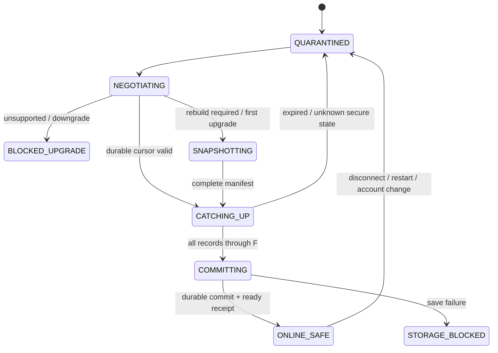

# Mutation Recovery v1 — 契约设计冻结候选

2026-09-09；设计标识 `meshx.mutation-recovery/1`；状态 **READY_FOR_APPROVAL**。这是 MX-A07B-1R 的冻结候选，批准后供1I实施；**不是IMPLEMENTED，也不表示已经获得实施批准**。规范中的“必须”描述目标契约。当前已部署v1与生产schema保持原样。

入口：[任务/handoff](../../tasks/active/MX-A07B-1R.md)；[接口与数据规范](wire.md)；[迁移、回滚与实施清单](implementation.md)；[目标向量](../../../contracts/test-vectors/mutation-recovery-v1-targets.json)。本设计替代旧[PROPOSED补充提案](../message-mutation-reconciliation-v1-supplement.md)中的待定方案，不覆盖[A07B-1原始事实](../../tasks/active/MX-A07B-1.md)。

## D01 两类持久位点

- **Message Sequence Cursor**：仍按会话保存，排序和连续新增消息恢复；message.sequence、CHAT_ACK、SYNC_REQUEST.positions、hasMore原义完全保留。
- **Mutation Recovery Cursor**：作用域为单逻辑节点中的**每用户**，所有设备读取同一条持久、有序流，但每台设备独立保存自己的消费位置；设备A前进不得让设备B的游标前进或触发按ACK清日志。
- 完整owner为`canonical origin + authenticated userId + streamEpoch`；每个入站任务还绑定连接generation。streamEpoch是每用户随机UUID，首次启用/不可兼容的数据恢复或流重建时更换；同数据库集群所有实例相同，不以进程/Redis重启更换。节点恢复较旧备份必须换epoch，不能复用递减的游标。
- 流位置是十进制无符号整数**字符串**，范围0..9223372036854775807；不可转JS Number。0表示尚无变更。message sequence仍用现有表示，不用mutation位点填入消息游标。
- 同一用户的已提交记录连续递增；分配计数器、记录和业务状态同事务，回滚不消耗已提交位置。不能按时间戳排序或按“收到最大值”跳过中间记录。

选择per-user的原因：recall/burn要扇出到有权持有内容的用户；群移除之后不能依赖“遍历当前可访问会话”才能发现失权；给被移除用户流写最小cid失效记录，即使其已不能读群仍能消费。群外新内容不进入该用户流。重新加入、好友可读不可发、所有设备恢复都由同一用户的访问状态版本连接起来。per-conversation或per-device作为唯一恢复位点会分别漏失权会话或增加设备注册盲区，因此不采用。

## D02 记录、类型与版本

精确字段见[record schema proposal](mutation-record.schema.json)。记录仅包含稳定eventId、streamEpoch、cursor、type、conversationId、适用时messageId/objectVersion、访问状态的accessVersion、committedAt。禁止正文、预览、附件URL、昵称、成员清单、token等。eventId对“一个源状态变更+一个接收用户”稳定，重试不分配新eventId/cursor；不同用户的同一源变更可有不同eventId，不向用户泄露其他接收者。

冻结类型：

| type | 语义 |
|---|---|
| MESSAGE_RECALLED | 原正文已撤回，终态 |
| MESSAGE_BURNED | 已焚毁/阅后销毁，终态；没有另造客户端自定到期时钟 |
| MESSAGE_UNAVAILABLE | 消息物理删除、合法保留期限清理或不可用tombstone，终态 |
| CONVERSATION_ACCESS_REVOKED | 对该用户read=false/send=false；reason为REMOVED/GROUP_REMOVED/DESTROYED/ACCESS_REVOKED；正文、outbox、路由失效 |
| CONVERSATION_ACCESS_CHANGED | 权限快照，包含readAllowed/sendAllowed/accessVersion/rebuildConversation；用于可读但禁发、重新获得权限、禁言等 |

READ不进入此流；保留本人CHAT_READ及会话摘要REST恢复。好友删除冻结为`readAllowed=true, sendAllowed=false`，不能清合法旧历史；群移除为两者false并清缓存/队列。发权限变化即使不改变读权限也必须入流，不能只依赖好友页面刷新。

对象版本：message初始objectVersion=1；每次实际终态转换在行锁下加1。NORMAL→RECALLED或BURNED或UNAVAILABLE；RECALLED/BURNED可进一步变为UNAVAILABLE，不能回NORMAL，也不能彼此转换。并发recall/burn首个合法提交获胜，后一个按原业务规则拒绝，不改变两分钟撤回等产品限制。相同终态重复请求先鉴权再幂等返回，无新版本/记录。存活messageId永久不重用。

客户端先比较版本；低版本忽略，相同版本同状态幂等，相同版本不同状态是PROTOCOL_ERROR并隔离。未知更高的已协商安全状态不猜含义，隔离受影响对象/会话并阻断当前恢复、游标不越过该记录。version再高也不能让终态转回NORMAL；违反单调规则时fail closed。tombstone先到时即创建无正文对象，再来的普通原消息不能复活。v1 CHAT_DELIVER/history没有目标objectVersion，只作暂存候选，不能覆盖安全缓存；新恢复快照是安全正文的权威来源。

accessVersion作用域为user+conversation，初始1，读/发权限每次变化递增。重入用更高版本和rebuildConversation=true，先完成该会话新快照才可展示；历史outbox永久失效，不随重入复活。会话ID不重用；本地移除该会话message cursor，重建时从新快照边界初始化，不影响其他会话游标。

## D03 恢复状态机与边界证明

**旧受保护缓存从启动/断开开始quarantine**，不展示正文、不走通知、不自动发送；允许显示不含敏感预览的“正在验证消息状态”外壳。冻结候选选择严格恢复模式：断网可写新的本地草稿，但不继续浏览未经恢复验证的旧正文。该离线体验收紧是本次需整体批准的产品取舍；不能沿用A05离线可读承诺又声称离线知道服务端新撤回。

### 首次/升级/rebuild：H→分页→F→原子提交

1. 认证后明确协商版本。建立recovery session，服务器在**同一个数据库一致读视图S**中读取该用户已提交mutation counter H、完整权威目录、每会话lastMessageSequence及message ID/objectVersion/accessVersion清单，生成不可变、排序manifest。业务状态和用户流同事务提交，故S不会只看见其一。
2. manifest只保存ID/版本/边界及必要访问元数据，不复制正文。创建必须完整成功才返回H和snapshotId，不能先返回H再异步用另一个读视图拼目录。通过MVCC一致读实现，禁止混用current read(counter FOR UPDATE)和旧读视图内容。生成开销/失败见容量门禁。
3. 客户端以opaque pageToken读取manifest，pageSize默认100、最大200；分页keyset稳定，所有页及明确snapshotComplete必须取得。消息页读取**当前**正文/状态，并重新检查权限：已撤回/删除则返回当前tombstone，失权返回该用户的最小失效状态；不返回旧正文。当前读取可以比S更新，版本规则保证随后较旧重放不能回退。
4. manifest完整后取得固定追赶边界F（数据库当时已提交latest）。重放用户日志区间(H,F]，不因消息sequence小而跳过。resume模式从已持久化C重放(C,F]，无需重建完整manifest，但权限变化/新会话要求的局部重建仍必须完成。
5. **新会话grant/new directory条目**必须写ACCESS_CHANGED(rebuildConversation=true)。局部重建按相同流程建立新恢复边界；最小实现可退回整账号rebuild，绝不可先推进cursor忽略该会话。新增普通消息用已有SYNC补拉，须把v1帧暂存，待新恢复快照确认object/accessVersion后方能展示/通知。对快照manifest之外的新消息，按同一会话增量manifest流程验证；若批次中有grant/epoch变化，重建重启。
6. 把staging消息状态/正文/墓碑、目录/访问、旧队列处置、通知资格/清理意图、message cursors和mutation cursor=F作为一个持久generation提交。失败不得把F写成已消费，也不开放UI。分页checkpoint只标staging，不能冒充已发布cursor。
7. 提交后调用ready确认（必须仍为同账号/epoch）；服务器给出当前latest L，L>F时继续追赶并持久化到新的固定F，不以latest赋值。L=F且session有效才获得ready receipt；客户端确认本地已持久化F后进入ONLINE_SAFE，再允许当前版本的展示和新操作。持续写入导致追不上时保持恢复状态并提示，不能降级假在线。

无遗漏论证：在S之前提交的变更反映在manifest/当前状态；S之后到F的变更必有同事务用户记录并被重放；page读取到F之后的新终态也只会单调变严。删除不会因旧正文页/缺行消失而被merge保留：manifest ID当前缺失必须返回durable UNAVAILABLE，完整重建替换旧active generation。F之后的变更由在线持久流继续恢复。ready返回和随后变更之间仍存在正常网络延迟，**mutation-safe是成功恢复及持续联通下的最终一致性，不是服务器提交瞬间远程抹除**。

ONLINE_SAFE必须周期性查询持久流：前台至少每5秒一次，并响应WS提示立即查询；后台/断网后不得靠WS未到就判断安全。无法完成查询超过30秒，或明确断开/权限失效，回quarantine，下一次展示前恢复。不承诺移动挂起时在线；严禁用后台保活绕过平台限制。

## D04 retention与过期

首版设计值：保留最近**至少30×24小时**的已提交mutation；按服务端UTC计算年龄，仅用于清理，不用于排序。清理只能删除连续前缀，设置`floor`为最后删除位置，`latest`为已提交最新。合法resume满足同epoch且floor≤C≤latest；C<floor为CURSOR_EXPIRED，C>latest为CURSOR_AHEAD（视为重建/数据恢复异常），epoch不符为STREAM_RESET。边界相等可续传。禁止按设备ACK提前删日志。

活动recovery session有效15分钟；创建manifest最长60秒，page请求限时30秒，session期间pin住所需日志前缀。过期后页/ready返回REBUILD_REQUIRED，不悄悄创建不一致新页。清理不允许删掉有效session仍需的记录；可拒绝新session或让其显式过期，不能隐藏截断。首版不做日志合并/中间条目压缩；将来compaction必须epoch重建或提供同等可证明的快照协议，再评审。

30天之外离线设备：显示“离线时间较长，需重新验证历史”，本地正文保持隔离，完整rebuild成功后恢复可读历史；失败保留恢复进度/草稿但不显示旧正文。不要求删登录凭据或卸载应用。新历史正常分页，不承诺一次拉无限记录；超过容量预算见implementation，保持显式BLOCKED而非截断成功。

日志retention≠tombstone retention。服务器消息终态/ID不复用记录及accessVersion在该对象可被任何历史接口引用期间保留；清理实体行必须保留无正文墓碑。客户端墓碑与可引用该ID的缓存同generation保存；不能定时清墓碑后接受晚到旧帧。彻底清账号数据需同时清消息、队列、路由和游标，下一次完整rebuild。规范计数器溢出必须在到达上限前换epoch重建，不能环绕。

## D05 事务、分发和并发

Java所有HTTP/WS/定时清理/管理删除入口必须调用同一个事务应用服务，形成：业务状态/版本 + 所有受影响用户的mutation record/counter + dispatch outbox fact，全成或全不成。Redis/WS推送不在提交必需路径；提交后由DB outbox派发，Redis短时失败不会丢记录，重试只重发提示，消费者按eventId幂等。

按conversation/access→message→recipient userId升序获取共同锁，send与remove/recall/burn使用同一权限序列化边界。读取并冻结接收者时必须和成员变更互斥：已撤销读权的用户已有REVOKED事实，可省后续消息细节；仍可读历史的前好友仍要收到recall/burn。成员/关系变化、原消息接收范围不能只依据“当前在线用户”或Redis会话集合。

并发remove/send：先提交remove则send重新检查权限失败，无消息写入/成功ACK；先提交send则remove会清其缓存资格，移除用户得到最小失效记录。收回许可无法回收已经飞行的网络字节；冻结承诺是已知失权及恢复期间不发旧队列，服务端事务拒绝失权写入，不宣称网络层零在途竞态。

相同源变更重试、死锁重试必须复用幂等键；事务回滚无业务变更/记录/outbox/成功提示。多实例共享数据库流，租约领取DB dispatch outbox，至少一次分发；不要求exactly-once网络发送。容量不足无法同步写全用户事实时整事务失败或限制该安全能力的适用规模，不改成可能漏人的异步扇出后立即成功。

## D06 客户端持久化、outbox与通知

一次成功mutation提交必须处理正文/预览/tombstone、conversation access、该消息/会话outbox、通知资格/路由、必要的message cursor清理及mutation cursor。Web需同一IndexedDB事务或同等generation切换，不能跨多个独立put后提前游标；Flutter以新格式原子generation写入，校验和/版本、磁盘同步及rename完成才发布。不是Widget临时hide。

保存失败：内存立即阻止暴露，但状态明确STORAGE_BLOCKED，不称已持久完成；磁盘旧generation不得被自动回滚展示。**每次启动先quarantine**，读取版本/校验和并恢复/重放成功后再开正文，因此“新安全写失败→重启读旧盘”也不能复活。staging失败可重试，不跳cursor。

旧缓存升级：新格式`recoveryStoreVersion=2`，旧记录没有state/access版本一律UNVERIFIED；首次rebuild后才迁入active，旧outbox全部置NEEDS_USER_ACTION并禁自动发。不可把旧消息默认成NORMAL版本1。旧缓存文件/DB namespace隔离，成功迁移后清旧正文副本；应用二进制降级不能重新加载旧正文，需保留不可降级标记和清旧副本，无法保证的旧包组合列不支持降级。

| 权限情形 | 历史 | 旧pending outbox | 恢复关系之后 |
|---|---|---|---|
| Read revoked/group removed | 清正文/预览/本地文件引用，墓碑和无正文失败原因保留 | DROP_BODY_REVOKED；正文及附件引用清除、禁止重试 | 不复活；新用户动作创建新clientMsgId |
| Send denied/read allowed（含删好友） | 可保留已验证历史 | NEEDS_USER_ACTION；保留显式本地草稿但无自动发送资格，不走通知/后台传输 | 旧条目仍禁自动发；重新确认权限后由用户创建新发送 |
| grant/rejoin | 完成局部或完整rebuild后按新accessVersion开放 | 所有旧失败条目保持终态 | 不能通过刷新摘要把状态重置queued |

新发送/队列flush前检查current owner、ONLINE_SAFE、当前accessVersion可发；服务端仍在事务中重查。断开后新草稿不等于已获未来发送授权。未知访问安全状态隔离，不默认true。

通知资格与取消意图在同一持久提交中记录；系统OS取消无法参加DB事务，提交后从durable effect outbox幂等执行，失败保留待重试，点击路由在本地立即失效。发送系统通知前再检查账号、消息版本/终态、accessVersion及live资格；mutation/rebuild/SYNC修正一律不产生新通知。OS已显示历史通知可能短时残留，只能声明取消请求/后续路由失效，不宣称原子撤回OS画面。完整点击UI仍属后续任务。

## D07 已读定义

ACK≠READ。READ仍是本人私有会话读位点，不进入普通mutation流，不推断peer read。

`foreground && current origin/user/generation && current accessible conversation && content actually visible`才产生新的读资格。actually visible冻结为：消息内容或安全终态占位在无遮挡的消息视口持续可见≥300ms；长消息允许其内容片段达到该窗口，后台/弹层完全遮挡/切换立即取消计时。Widget建立、history下载、列表缓存、收到消息都不算。

位点为**从已确认lastReadSequence之后连续已取得阅读资格的可读消息前缀**；自发消息、权威物理缺口与无需正文的终态可按规则跨过，但未看见的可读正文不能跨过。跳至底部不能仅取最大sequence越过未读中间段；这是比旧Web更严格的目标，需要共享向量与UI回归。不使用未知缺失sequence作为可跳过证明。

后台/未打开不推进新位置；已在前台获得的位点可在重新前台且账号/权限匹配后延迟发送，后台不flush。恢复时先取本人已读摘要，服务端采用单调max并限制合法会话范围；history SYNC本身不产生读资格。Web/Dart各自收集视口观察并执行纯core规则，300ms是产品规则，不是网络时钟/服务器已读时间证明。

## D08 Legacy fallback与最低能力政策

新安全客户端的默认是**B：阻断**。缺少明确version1能力（404、旧响应、网络不确定、未知版本）不得宣称同步完成，显示需升级服务器；不清登录凭据，可管理节点/退出，受影响聊天阅读/发送/通知保持隔离。不能从可选字段没出现推断支持。

v1 full rebuild只保留为legacy compatibility fallback，**本候选不启用**。现有v1无稳定H/权威snapshot完整性/中途mutation屏障，A07B-1仅证明从0可取保留行状态，不足以认证fallback。除非另一个受控任务证明整个重建期间业务写入/权限变更被可信服务器屏障冻结，并保证完整目录/物理缺失语义及安全开放后的持续恢复，否则不能使用；靠“通常没人改”“最近200条”“多拉两遍”不合格。需要临时freeze barrier的老服务器实际上必须明确提供/验证这个兼容能力，不能客户端猜测。

单独fallback验收必须覆盖quarantine、权威目录、完整分页、分页中mutation/权限变化、半途失败、物理删除、大历史、重启中断，以及开放后立即发生变更。任一条件不能证明则仍选B。它不是长期主路径或当前Release Gate豁免。

| Server / Client | 能否聊天 | mutation-safe | rebuild / 升级 | rollback |
|---|---|---|---|---|
| old / old | 当前v1原行为可用 | 否 | 无安全声明；需双方升级 | 保持已知风险，不升级标签 |
| new / old | 默认保留v1协议通信 | 否 | 新服务端字段不会修好老缓存；要求安全的组织必须升级客户端 | 不能因回滚到旧客户端恢复安全标签 |
| old / new | 登录/节点管理可用；受影响聊天阻断 | 否，明确blocked | 默认必须升级服务端；fallback未认证 | downgrade检测后quarantine，不回退旧缓存 |
| new / new | 成功协商/恢复后可用 | 满足本设计且验收通过才是 | 首次/过期/epoch变更rebuild | 保留日志；降级阻断/重新建边界 |

最低能力：新Mobile安全首发要求server和client均支持`meshx.mutation-recovery/1`。普通旧Web仍可通信但不能记为安全门禁已通过；组织如要求全部客户端安全，必须启用单独经批准的最低客户端版本/升级部署政策，不能仅凭客户端自报capability把恶意或旧客户端当可信。该组织强制策略不在本轮暗改登录/device v2。
